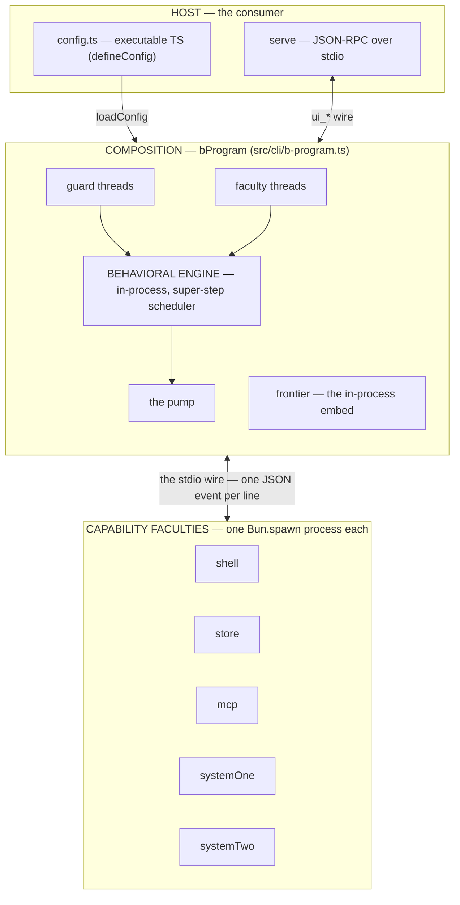
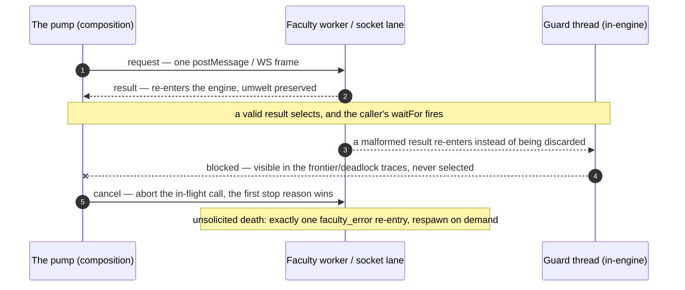

# @behavioral/sh

A behavioral agent harness. The engine is an in-process behavioral-programming
interpreter; capability faculties run as processes behind one faculty event
wire; hosts drive the runtime through a `ui_*` egress/ingress vocabulary; and
validation lives in guard threads whose rejects are visible in the traces.

The defining inversion: **there is no imperative agent loop.** Whatever looks
like an agent — turn-taking, tool use, self-improvement — is declared as
behavioral threads (request / waitFor / block / transform bids on events) that
the engine's super-step scheduler interprets. Hosts attach ingress through
`trigger`, observe through the trace stream, and own the process lifecycle.

## Architecture



**One wire.** Every faculty speaks the same behavioral event vocabulary
(`faculties.types.ts` + `faculties.constants.ts` — one home for every
request/result kind, schema, and validator): requests in as one JSON line,
results out as one JSON line, `umwelt` preserved end to end. The engine itself is
generic over events and never imports the wire.

**Every faculty is a web worker.** Wired through `useWorker` (the worker lane)
or `socketLane` (the WebSocket lane over the daemon bridge) — both yield the
ruled four-key lane (`name`, `send`, `invalidEventGate`, `terminate`). The
actuators (shell, store, security) are spawned processes per the daemon's
allow-list; the fixed three (systemOne, systemTwo, remoteSystemTwo) are the
composition's own workers, their config riding the init frame. Crash synthesis
is exactly one `faculty_error` re-entry; the pump discards only what cannot be
this lane's event, and a parsed-but-invalid result re-enters the engine —
observable in the traces, guarded by the wire home's schemas.

The life of a request over that lane:



**Model config is data, not wiring.** `systemOne` and `systemTwo` are always
mounted (the composition's fixed workers); without endpoint config they answer
the typed error — fail-visible, never absent. The config carries the model
identifiers (the `systemOne` endpoint config, the `systemTwo` endpoints map,
the `ui` generation target) as data riding the init frame; secrets ride as
env-resolved values, never literals.

**Validation is threads, not middleware.** Guard threads derive from the wire
home's once-compiled schemas; the controller and the JSON-RPC codec are dumb
relays. A malformed event is never selected — it is blocked, and the
reject is observable in the frontier, the pending bids, and the deadlock traces.

## Repository Map

- `src/behavioral/` — the pure language layer: types, constants, the
  interpreter core and its trace stream
- `src/faculties/` — the browser-side thinking layer: the wire home (types,
  validators, kinds), `create-worker.ts` (the in-worker bootstrap), the
  worker entries (`system-one/system-two/remote-system-two.faculty.ts`), the
  admission/judgment/supervision threads, and the socket lane
- `src/b-program/` — the composition (`b-program.ts`, the ruled
  two-key-plus-lanes surface) and its host-minted thread packs, the worker
  entry (`b-program.worker.ts`), and the serving seam
- `src/actuators/` — the daemon-side capability layer (shell, store,
  security): the process entries and their spawner
- `src/cli/` — the host entries (`serve`, the socket host, attach-or-start),
  `init` (config generation), `load-config`, the trace consumer, the
  plugin-thread registry
- `src/controller/` — the browser Controller (a dumb relay), its `ui_*`
  vocabulary, and the AJV detail schemas hosts/threads use
- `src/utils/` — shared pure utilities
- `bin/behavioral.ts` — the CLI entry (`behavioral init`, `behavioral serve`)
- `skills/` — published reference skills · `.agents/skills/` — workspace
  installed skills
- `AGENTS.md` — the working law of the repo

## Public API

Imported as `@behavioral/sh`:

```ts
// The config helper — what a <home>/config.ts default-exports
// (types it accepts: the bProgram options)
import { defineConfig } from '@behavioral/sh'

// The faculties surface — the wire home: the lane types (FacultyLane,
// LaneBuilder), the event types + once-compiled validators, the model
// identifier types (SystemOneEndpointConfig, SystemTwoEndpoints),
// and useWorker (the composition's worker lane)
import { useWorker } from '@behavioral/sh/faculties'

// Controller — browser-side controller bootstrap
import { Controller } from '@behavioral/sh/controller'

// Utils — keyMirror, deepEqual, isTypeOf, trueTypeOf, ueid, case conversion, escape, wait
import { keyMirror, deepEqual } from '@behavioral/sh/utils'
```

### Composing

```ts
import { defineConfig } from '@behavioral/sh'

// The daemon's config: the actuator allow-list plus the model identifiers
// (data riding the faculties' init frame; keys are env-resolved values).
export default defineConfig({
  actuators: ['shell', 'store', 'security'],
  systemOne: { url: 'https://api.typesafe.ai/v1/systemone', apiKey: process.env.TYPESAFE_API_KEY, model: 'jev-latest' },
  systemTwo: { openai: { url: 'https://api.openai.com/v1', apiKey: process.env.OPENAI_API_KEY } },
})
```

Sizing a harness out:

```bash
behavioral init          # interactive at a TTY (defaults pre-filled), or
behavioral init '{...}'  # agent JSON — see --schema input
```

The composition returns `{ trigger, useTrace, start, terminate }`: subscribe
before `start()` so boot traces are observable; `terminate()` kills every
faculty worker it wired and every actuator lane it completed. The browser
boots the same composition per tab in a dedicated worker
(`src/b-program/b-program.worker.ts`); the page attaches over the controller's
worker transport with its provider map, which becomes the faculties'
init-frame config.

## Development

```bash
bun run check   # biome + tsc --noEmit
bun test        # the full suite
```

Working rules live in `AGENTS.md`.
